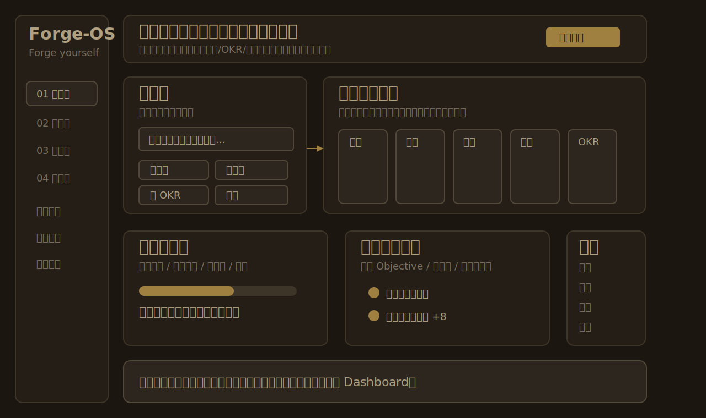
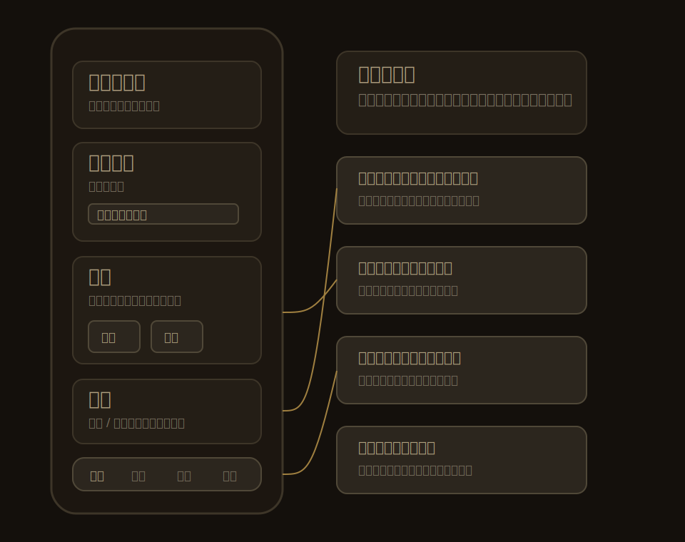
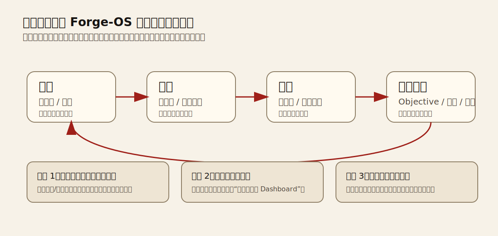

# Forge-OS 专家团优化评审

> 日期：2026-06-07  
> 范围：对比 `E:\github\matrix-life-os` 与 `E:\github\maverickgao8848-matrix-life-os` 后，评审桌面端与移动端下一阶段优化建议。  
> 结论：先补完整增长闭环，不做大范围模型扩张。

## 评审团队

| 角色 | 职责 |
| --- | --- |
| 产品设计师 | 判断产品定位、用户价值、优先级和边界 |
| 资深系统架构师 | 评估数据契约、V3 同步、本地优先和长期架构风险 |
| 资深开发工程师 | 评估 React/TypeScript/Electron 落地路径、复用点和工程风险 |
| 资深桌面端 UI 设计师 | 评估桌面信息架构、布局、交互密度和视觉一致性 |
| 资深安卓架构设计师 | 评估 Android/移动端边界、离线、返回栈、输入法和兼容性 |
| 测试工程师 | 评估验收标准、自动化测试矩阵和上线 gate |

## 最终结论

Forge-OS 不应回退成原版 matrix-life-os 的完整 GTD 行动台，也不应继续堆模块。下一步应补硬一条核心路径：

```text
捕捉 -> 执行 -> 复盘 -> 成长证据 -> 下轮目标修正
```

专家团一致建议：

1. **必做：桌面端恢复轻量收集箱与澄清入口。**
2. **必做：系统页增加只读数据健康与使用指南。**
3. **必做：补充每日 / 每周使用仪式，让用户知道什么时候做什么。**
4. **可做：模块按阶段分组，但只做展示层，不改 `ModuleId` 和持久化语义。**
5. **可做：成长证据档案先做派生视图，不新增持久实体。**

一句话：**Forge 的方向比原版更大，但原版的入口更锋利；现在要把入口补回来，把成长证据看得见。**

## 样例图

### 桌面端样例



**调整原因**

- 当前 Forge 周看板直接从任务板开始，缺少“脑内混沌进入系统”的第一入口。
- 原版 `QuickInbox` 的价值在于先收集、再澄清，但原版完整拖拽行动台不适合直接搬回 Forge。
- 桌面端适合承接完整澄清：今日任务、收纳任务、灵感、后续再考虑 Objective / KR。

**收益**

- 降低用户每天打开产品后的第一步摩擦。
- 让周看板从“已有任务管理”变成“从想法到行动”的入口。
- 不需要新增新页面，也不需要改 V3 同步模型。

### 移动端样例



**调整原因**

- 移动端已有 `今日 / 推进 / 记录 / 系统` 四入口，边界是对的。
- 手机不适合承接完整桌面澄清器；复杂 Objective / KR 整理应留在桌面。
- 移动端最重要的是 30 秒内完成：记录、推进、收纳、轻复盘、看同步状态。

**收益**

- 手机端保持低摩擦，不变成缩小版桌面控制台。
- 避免 Android 输入法、返回栈、窄屏和性能风险。
- 桌面和移动继续写入同一批任务、灵感、反思实体。

### 成长闭环样例



**调整原因**

- Forge 的长期定位是“目标确认与自我锻造”，不是任务管理器。
- 周复盘已经具备证据基础，但长期成长证据还没有变成清晰产品层。
- 月成长报告的价值依赖“每周证据”持续沉淀。

**收益**

- 用户能看到自己不是只完成任务，而是在积累能力与判断。
- 产品从“今天做什么”升级为“我正在锻造什么”。
- 为未来月度成长报告和 AI 复盘助手打基础。

## 分项评审

### P0. 轻量桌面收集箱

**结论：必做。**

建议在周看板首屏顶部增加轻量收集入口：

- 默认显示一行输入框、待澄清数量、展开按钮。
- Enter 快速收集。
- 展开后显示待澄清列表。
- MVP 澄清目标只做：今日任务、收纳任务、灵感、删除。
- Objective / KR / 日历 / 习惯转换暂缓。

**原因**

- 原版 matrix-life-os 的 `QuickInbox` 是最强入口，但 Forge 当前桌面端没有等价入口。
- Forge 已经保留 `InboxItem` 和任务看板接收 `inbox-` 拖入任务列的能力。
- 但当前 `OKRInboxColumn` 文案偏“OKR 焦点”，不能把普通想法直接塞进去而不改语义。

**收益**

- 补回“混沌进入系统”的入口。
- 避免用户把 Forge 当成只能管理已计划任务的工具。
- 实现成本低于整页恢复 ActionDesk。

**边界**

- 不新增一级页面。
- 不恢复原版完整 ActionDesk。
- 不在 Dashboard 外层再包大型 DnD，避免和 `TaskBoard` 内部拖拽冲突。
- 不新增桌面专属 capture 模型。

### P0. 系统页数据健康与使用指南

**结论：必做。**

建议系统页调整为：

1. 数据健康摘要：本地数据、同步状态、冲突数、待上传、本机存储路径、最近备份。
2. 备份与同步：保留现有导入导出、COS V3 状态。
3. 使用指南：折叠式“早上 / 白天 / 晚上 / 周末”使用仪式。

**原因**

- Forge 系统页当前强在同步，但用户需要更高层的“系统是否健康”判断。
- 原版有 `DataHealthPanel` 和 `ManualPanel`，方向值得参考。
- V3 同步已有 namespace、revision、初始化、冲突等状态，可以做只读汇总。

**收益**

- 用户更容易信任本地优先 + 云同步。
- 减少“数据在哪里、有没有同步、能不能恢复”的焦虑。
- 指南能让产品从功能集合变成可执行仪式。

**边界**

- 健康检查只读，不重置 V3 baseline。
- 不新增会修改 `syncStatus` 的诊断动作。
- 不恢复原版可拖拽系统页，系统维护顺序要稳定。

### P0. 每日 / 每周使用仪式

**结论：必做。**

建议写成产品内轻提示和 README 使用节奏：

```text
早上：清空收集箱，选出今日承诺。
白天：推进最多三件事，临时想法先收集。
晚上：写每日反思，留下今天的证据。
周末：打开周复盘，沉淀完成、卡点和下周一件调整。
月底：查看成长证据，修正下月目标。
```

**原因**

- 原版 README 的“早上 / 白天 / 晚上”仪式非常清晰。
- Forge 长期计划已经定义“周是执行节奏，月是成长节奏”，但产品内表达还不够直接。

**收益**

- 降低学习成本。
- 让周复盘、反思库、月度 OKR 不再像孤立页面。
- 帮助用户形成重复使用节奏。

**边界**

- 仪式是 workflow，不新增 `ritual` 数据模型。
- 不做“仪式完成率”统计，除非后续单独评审。

### P1. 模块按阶段分组

**结论：可做，但只做展示层。**

建议使用 Forge 自身阶段，而不是照搬原版 GTD：

| 阶段 | 模块 |
| --- | --- |
| 定向 | 月度 OKR、原则 |
| 捕捉 | 收集箱、灵感 |
| 执行 | 今日进度、周看板、时间块、习惯、情绪 |
| 复盘 | 每日反思、周复盘 |
| 成长证据 | 反思库、能力、完成 Objective、月度报告 |
| 维护 | 备份、同步、系统健康、模块管理 |

**原因**

- 原版 `gtdPhase` 能让模块不散。
- Forge 的产品目标不是纯 GTD，而是成长闭环。

**收益**

- 模块管理更容易理解。
- 导航和页面说明能围绕成长闭环组织。
- 减少“功能很多但不知道为什么在这”的感觉。

**边界**

- 不改 `ModuleId` 值。
- 不把核心页面塞进 `enabledModules`。
- 不改变持久化字段。

### P1. 成长证据档案

**结论：先做派生视图，暂缓新增持久实体。**

MVP 建议：

- 周复盘页：增强“本周证据”，展示完成任务、未完成任务、能力加分、相关反思。
- 反思库页：新增“成长证据档案”区，聚合周复盘、完成 Objective、能力里程碑。
- 月度 OKR 页：预留“本月证据”入口，为月报做准备。

**原因**

- Forge 的价值不是任务完成，而是证明成长发生过。
- 现有任务、能力、反思已经包含可派生证据。

**收益**

- 让“自己锻造自己”从 slogan 变成可见资产。
- 支撑未来月度成长报告和 AI 复盘助手。
- 不增加 V3 collection 和 merge 风险。

**边界**

- 不新增 `EvidenceRecord`。
- 不改 `AppState`、V3 adapter、V3 merge。
- 后续如需独立证据实体，必须单独走契约变更。

## 移动端策略

移动端不做桌面全量复制。最终边界：

| 移动入口 | 负责什么 | 不负责什么 |
| --- | --- | --- |
| 今日 | 今日状态、今日承诺、快速新增任务 | 完整目标建模 |
| 推进 | 周任务、收纳箱、轻量周复盘 | 完整成长档案总览 |
| 记录 | 灵感、每日反思 | Objective / KR 澄清 |
| 系统 | 同步摘要、健康摘要、风格/主题/模块入口 | 完整系统维护台 |

**Android 专项要求**

- 离线新增任务、灵感、反思、BACKLOG 后，重启仍保留。
- COS 未配置或失败时，本地读写不被阻断。
- Android 返回优先级：先关弹层，再退模块，再退出 App。
- 输入法弹出时，保存/取消按钮仍可点，底部导航不遮挡。
- 大字体和 TalkBack 下，主入口、任务操作、同步状态可读。

## 实施顺序

### 第一阶段：系统信任与使用节奏

- 系统页增加数据健康摘要。
- 系统页增加折叠使用指南。
- README / 产品文案补每日、每周、每月仪式。
- 更新结构测试和系统页测试。

### 第二阶段：桌面收集入口

- 新增轻量收集条。
- 支持收集项新增、删除。
- 支持澄清为今日任务、收纳任务、灵感。
- 调整 OKR 焦点 / inbox 文案边界，避免普通想法被误读成 KR。

### 第三阶段：阶段分组与成长证据

- 模块管理增加阶段分组展示。
- 周复盘增强本周证据。
- 反思库增加派生成长证据档案。
- 月度 OKR 预留本月证据入口。

## 不做清单

- 不整页替换 `Dashboard` 为原版 `ActionDesk`。
- 不直接搬原版完整 `InboxClarifier`。
- 不一次性支持收集项转 Objective / KR / Calendar / Habit / Entertainment。
- 不新增桌面和移动两套 capture 数据模型。
- 不改 V3 同步 runner、Electron 存储层或 Android 私有存储。
- 不新增 `EvidenceRecord` 持久实体，除非单独做契约评审。
- 不恢复原版系统页可拖拽面板。
- 不让移动端承接桌面完整澄清流程。

## 验收 Gate

上线前必须通过：

```bash
openspec validate --all --strict --no-interactive
node --test tests/*.test.ts
npm run lint
npm run build
npm run android:build
npm run android:smoke
```

如无 ADB 设备，`android:smoke` 可临时降级为 APK 构建 + 手工真机截图清单，但不能跳过移动端四页：今日、推进、记录、系统。

## 专家团最终意见

最终建议采用 **“轻入口 + 稳契约 + 派生证据”** 方案：

- 轻入口：桌面收集箱补回原版最强入口。
- 稳契约：不急着新增实体，不破坏 V3 和本地优先。
- 派生证据：先从现有任务、反思、能力中生成成长证据。

这条路线最符合 Forge-OS 当前阶段：它能明显改善产品体验，又不会把已经复杂的同步和跨端系统拖进高风险重构。
