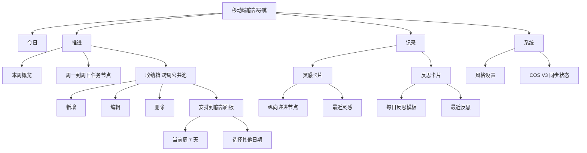

# Mobile Daily Loop UI Optimization Design

## Goal

优化 Forge-OS Android/手机端的日常闭环体验，让用户可以在移动端独立完成今日推进、任务收纳、灵感记录、反思沉淀、同步状态判断和本机风格设置，同时不回退任何现有可用功能。

## Approved Direction

采用一个整体改造包，而不是拆成多个零散修复。本次需求覆盖移动端「系统」「推进」「记录」三个模块，以及移动端风格同步策略。

用户已确认的关键决策：

- 收纳箱放在「推进」页周日下方。
- 收纳箱是跨周公共池，不属于任何一周；切换周时仍展示同一批收纳任务。
- 收纳箱任务没有固定日期，用户安排后才移动到指定日期。
- 收纳箱支持新增、编辑、删除、安排到日期。
- 安排任务使用底部面板，优先展示当前查看周的 7 天快捷按钮，并支持选择其他日期。
- 记录页取消底部混合「记录流 / 最近保存」。
- 灵感卡片内部展示最近灵感，反思卡片内部展示最近反思。
- 灵感流程保留一步一步递进体验，但从横向步骤改为纵向节点。
- 移动端风格默认跟随桌面；用户主动打开「本机独立风格」后，移动端风格不再影响桌面端。

## Non-Regression Constraint

本次优化的首要约束是功能可用性不回退。

所有视觉、布局和交互调整 MUST 保留以下能力：

- Android/手机端本地离线读写继续可用。
- 今日页新增任务继续写入同一任务数据流。
- 推进页任务完成、取消完成、编辑、移动到明天、收纳、删除继续可用。
- 收纳任务继续复用现有任务模型，不引入 Android 专属任务模型。
- 记录页灵感保存继续写入灵感库，并保留来源和标签。
- 记录页反思保存继续写入每日反思，不误入灵感库。
- COS V3 同步继续使用现有 V3 实体文档和本地基线语义。
- 桌面端布局、任务看板、反思库、系统页和风格切换不因移动端改造发生明显回退。

## User Scenarios

### Scenario 1: 用户在系统页判断同步状态

用户打开手机端系统页，只想确认「是否已经同步」「有没有本地待上传」「有没有冲突」。旧基线和 V3 基线同时展示会让用户误以为存在两个有效同步来源。

设计目标：默认只展示当前有效的 V3 状态；旧基线仅作为调试或兼容信息隐藏在次级区域，不和 V3 状态并列。

### Scenario 2: 用户把任务先收纳，稍后再安排

用户在推进页看到一个当前不确定日期的任务，点击「收纳」。之后用户希望在手机端直接看到这些被收纳的任务，并在合适时安排到具体日期，而不是必须回桌面端处理。

设计目标：推进页周日下方提供跨周公共收纳箱，支持维护和安排。

### Scenario 3: 用户在记录页快速保存灵感

用户临时产生想法，先记录想法，再可选补来源和标签，最后确认保存。当前横向步骤和竖向节点同时存在，交互方向不一致。

设计目标：使用纵向递进节点，当前步骤展开，已完成步骤折叠为摘要，未到步骤弱化。

### Scenario 4: 用户展开记录输入后想收起

用户点击「写一条灵感」或「写一条反思」后，发现无法再次收起，只能切换模块再回来。

设计目标：入口按钮具备展开/收起语义，展开态提供明确收起或取消路径。

### Scenario 5: 用户区分最近灵感和最近反思

用户保存灵感后希望在灵感卡片附近看到最近灵感；保存反思后希望在反思卡片附近看到最近反思。混合记录流把两种信息合在一起，语义不清。

设计目标：取消混合记录流，拆成两个卡片内记录流。

### Scenario 6: 用户希望手机和桌面使用不同视觉风格

手机端适合一种更稳定的移动视觉，但桌面端可能使用另一种工作台风格。当前风格切换可能跨端互相影响。

设计目标：默认沿用同步风格，用户主动打开本机独立风格后，手机端使用本机偏好，不再写入跨端同步风格。

## Information Architecture



## Requirements

### 1. System Sync Panel

系统页同步面板 MUST 降低旧基线的可见性，避免和 V3 基线并列误导。

Required behavior:

- 默认状态区域展示：状态、设备、最近同步、V3 基线、V3 初始化、V3 合并、V3 冲突、待上传本地变更、V3 命名空间。
- 当 V3 已初始化或存在 V3 revision 时，旧 `基线` 不应在主状态区出现。
- 如确需保留旧基线信息，应放入「调试信息」「旧版快照」或展开式次级区域。
- 文案必须让用户知道当前日常同步使用 V3。
- 立即同步、修改配置、冲突提示、配置保存后收起能力必须保留。

Acceptance criteria:

- V3 已初始化时，主同步状态不同时出现「基线」和「V3 基线」两个同级字段。
- 用户仍可手动同步并查看 V3 冲突数量。
- 本地待上传状态仍以「待上传本地变更」展示。

### 2. Mobile Backlog Inbox

推进页 MUST 在周日下方新增收纳箱，作为跨周公共池。

Required behavior:

- 收纳箱位置在当前周日节点之后。
- 收纳箱展示所有 `date === 'BACKLOG'` 的任务。
- 切换上一周、本周、下一周时，收纳箱内容不随周切换变化。
- 任务点击「收纳」后从原日期移入收纳箱。
- 收纳箱内任务支持新增、编辑、删除。
- 收纳箱内任务支持「安排」动作。
- 安排动作打开底部面板。
- 底部面板显示当前查看周的周一到周日快捷按钮。
- 底部面板提供「选择其他日期」入口。
- 选择日期后，任务从收纳箱移出，进入对应日期任务列表。

Design notes:

- 收纳箱不是第 8 天，也不是当前周的一列；它是跨周公共任务池。
- 收纳箱任务在数据层继续使用现有 `Task`，以 `date === 'BACKLOG'` 表达未安排。
- 安排到具体日期时，使用现有 `moveTask(taskId, targetDate, order)` 语义。

Acceptance criteria:

- 手机端把一个任务收纳后，无需桌面端即可在推进页底部看到它。
- 用户切换到上一周或下一周，收纳箱仍展示相同收纳任务。
- 用户可新增一个收纳任务，并安排到当前查看周的某一天。
- 用户可把收纳任务安排到非当前周日期。
- 删除收纳任务必须有确认或明确危险反馈，避免误删。

### 3. Mobile Task Action UI

推进页任务操作按钮 MUST 保留功能，但视觉上更轻、更适合列表扫读。

Required behavior:

- 保留完成、编辑、明天、收纳、删除能力。
- 将当前大圆按钮改为更轻的操作形态，例如小尺寸文字按钮、图标加文本、更多菜单，或紧凑 action row。
- 触控热区不得小于移动端可用下限，建议维持约 44px 可点击区域，但视觉外形可以更轻。
- 删除操作必须继续具备确认态。
- 操作区不得挤压任务标题到不可读。

Acceptance criteria:

- 同屏可见任务密度高于当前大圆按钮方案。
- 用户仍能清楚找到编辑、明天、收纳、删除。
- 任务标题长文本不与操作按钮重叠。
- 完成态任务仍能取消完成。

### 4. Mobile Inspiration Workflow

记录页灵感捕捉 MUST 使用纵向递进节点。

Required behavior:

- 节点顺序为 `01 想法 -> 02 来源 -> 03 标签 -> 04 确认`。
- 当前步骤展开输入或确认内容。
- 已完成步骤折叠展示摘要。
- 未到步骤弱化，不可误以为已经完成。
- 来源和标签保持可选。
- 用户可以从来源或标签步骤返回上一步。
- 保存后灵感进入灵感库，并保留来源和自定义标签。

Wireframe:

```text
灵感先收进来
|
● 01 想法
|  [写一条灵感...]
|  [下一步：来源]
|
○ 02 来源
|  未开始
|
○ 03 标签
|  未开始
|
○ 04 确认
   未开始

最近灵感
[时间] 灵感内容 / 来源 / 标签
```

Acceptance criteria:

- 页面不再同时出现左侧竖线和横向 stepper 两套流程表达。
- 用户按纵向节点一步一步完成保存。
- 保存后的灵感只出现在灵感卡片的最近灵感中。

### 5. Mobile Composer Expand And Collapse

记录页写灵感和写反思入口 MUST 支持展开后收起。

Required behavior:

- 点击收起态「写一条灵感」展开灵感输入。
- 展开态再次点击入口或点击明确的「收起/取消」可收起。
- 点击收起态「写一条反思」展开反思输入。
- 展开态再次点击入口或点击明确的「收起/取消」可收起。
- 收起未保存内容时，如输入为空可直接收起；如已有输入，应避免静默丢失，可保留草稿或提示确认。
- 切换模块不应是唯一收起方式。

Acceptance criteria:

- 用户不切换底部导航也能收起灵感输入。
- 用户不切换底部导航也能收起反思输入。
- 已保存状态仍能查看或编辑今日反思。

### 6. Separate Recent Inspiration And Reflection Lists

记录页 MUST 取消混合记录流，改为两个独立最近列表。

Required behavior:

- 灵感卡片内部展示「最近灵感」。
- 反思卡片内部展示「最近反思」。
- 取消底部统一「记录流 / 最近保存」区域。
- 最近灵感只包含移动端保存的灵感或明确归为灵感的记录。
- 最近反思只包含移动端保存的每日反思记录。
- 两个列表都展示设备本地时间，不直接展示 UTC ISO 字符串。

Acceptance criteria:

- 保存灵感后，在灵感卡片内看到最近灵感。
- 保存反思后，在反思卡片内看到最近反思。
- 页面底部不存在混合「记录流 / 最近保存」卡片。

### 7. Mobile Visual Style Sync Preference

系统页风格设置 MUST 支持移动端本机独立风格。

Required behavior:

- 默认状态为「跟随桌面 / 参与同步」。
- 用户可开启「本机独立风格」。
- 开启后，移动端风格切换只影响当前设备或当前移动运行环境。
- 开启后，移动端风格切换不应更新会跨端同步到桌面的视觉风格字段。
- 关闭后，移动端重新跟随同步风格。
- 文案应解释：本机独立风格只影响当前手机，不影响桌面。

Data and sync notes:

- 如当前视觉风格状态只存在 React 本地状态，应评估是否需要新增端侧持久化字段。
- 若新增字段，必须和跨端同步的全局 config 区分。
- 手动密钥、V3 基线和业务数据同步语义不得因风格偏好改变。

Acceptance criteria:

- 默认情况下，移动端风格行为与现有跟随桌面一致。
- 开启本机独立风格后，移动端切换风格不会改变桌面端同步后的风格。
- 关闭本机独立风格后，移动端重新显示同步风格。

## Implementation Boundaries

Likely touched areas:

- `src/features/mobile/MobileWeekProgress.tsx`
- `src/features/mobile/MobileCaptureHub.tsx`
- `src/features/mobile/MobileAppShell.tsx`
- `src/features/system/SyncPanel.tsx`
- `src/App.tsx`
- `src/index.css`
- `src/store/slices/configSlice.ts` or a mobile preference slice if needed
- `src/types/*` if mobile-only style preference needs a typed persisted field
- Structure tests under `tests/mobileProductStructure.test.ts`
- Sync panel tests under `tests/syncPanelStructure.test.ts`

Do not touch unless required:

- Android native WebView shell behavior.
- COS V3 merge engine.
- Business entity schemas for tasks, inspirations, and reflections.
- Desktop board layout and desktop reflection pages.

## Testing Strategy

Minimum verification:

- Run existing structure tests for mobile product and sync panel.
- Add tests that assert:
  - Sync panel does not show legacy baseline beside V3 baseline in main status.
  - Mobile progress renders a backlog inbox after week day nodes.
  - Backlog tasks use `date === 'BACKLOG'` and can be moved to selected dates.
  - Mobile task action UI keeps edit, tomorrow, archive, delete operations.
  - Mobile capture uses vertical inspiration steps.
  - Mobile capture has separate recent inspiration and reflection sections.
  - Mixed mobile capture history section is removed.
  - Inspiration and reflection composer can be collapsed without switching modules.
  - Mobile style independent toggle exists and defaults to follow desktop.
- Run build or type check after implementation.
- If visual implementation changes are substantial, verify in a mobile viewport or Android smoke path.

## Risks And Mitigations

- Risk: Making buttons smaller can harm touch usability.
  - Mitigation: Reduce visual bulk while preserving about 44px hit area.
- Risk: Backlog inbox becomes visually buried below a long week.
  - Mitigation: Keep it after Sunday as requested, but use a clear section header and count.
- Risk: Mobile style independence leaks into cross-device config.
  - Mitigation: Store local-only preference separately from synced config, or explicitly exclude it from sync.
- Risk: Refactoring capture history breaks saved reflection behavior.
  - Mitigation: Keep save paths unchanged; split only presentation lists.
- Risk: Sync panel simplification hides useful diagnostics.
  - Mitigation: Keep diagnostics available in a secondary expanded area.

## Success Criteria

This change is successful when:

- A user can collect, edit, delete, and schedule backlog tasks entirely on mobile.
- A user can capture inspiration and see recent inspirations within the same card.
- A user can write or edit reflection and see recent reflections within the reflection card.
- A user can collapse expanded mobile composers without leaving the page.
- A user can understand current V3 sync status without old baseline confusion.
- A user can keep mobile visual style local while preserving default follow-desktop behavior.
- Existing core mobile functions remain available and tested.
